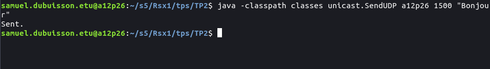
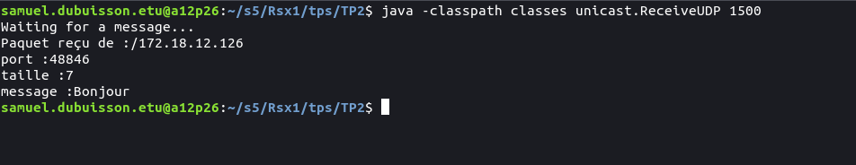
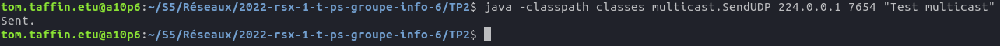
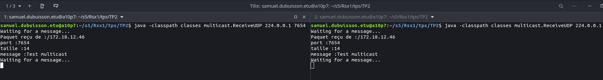
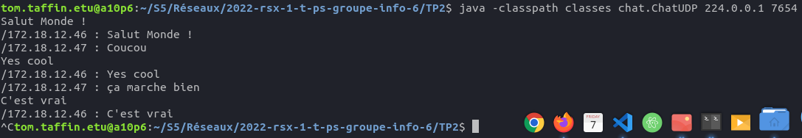
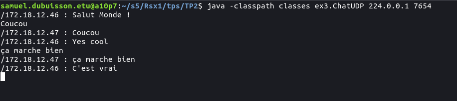

# Rapport pour le TP2
- Tom Taffin
- Samuel Dubuisson

## Exercice 1
Voici ce qui a été envoyé et ce qui a été reçu par chaque programme : 

  

Commande pour envoyer "Bonjour" à l'adresse de l'ordinateur a13p13 sur le port 1500 (après avoir compilé le TP avec `make cls`) :  
`java -classpath classes unicast.SendUDP a13p13 1500 "Bonjour"`  

  

Commande pour recevoir un message sur le port 1500 (après avoir compilé le TP avec `make cls`) :
`java -classpath classes unicast.ReceiveUDP 1500`  

## Exercice 2
Voici ce qui a été envoyé et ce qui a été reçu par chaque programme :

  

Commande pour envoyer "Bonjour" à l'adresse multicast 224.0.0.1 sur le port 7654 (après avoir compilé le TP avec `make cls`) :  
`java -classpath classes multicast.SendUDP 224.0.0.1 7654 "Bonjour"`  

  

Commande pour recevoir les messages envoyées sur le multicast 224.0.0.1 sur le port 7654 (après avoir compilé le TP avec `make cls`) :  
`java -classpath classes multicast.ReceiveUDP 224.0.0.1 7654`  

## Exercice 3
Voici ce qui a été envoyé et ce qui a été reçu par chaque programme : 
 
  

  

Commande pour lancer un chat sur l'adresse 224.0.0.1 et le port 7654 (après avoir compilé le TP avec `make cls`) :  
`java -classpath classes chat.ChatUDP 224.0.0.1 7654`  
